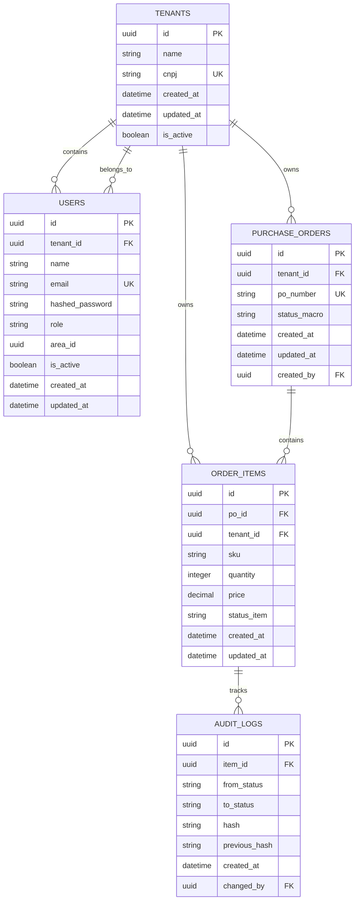

# FlexFlow - Arquitetura do Banco de Dados

## Visão Geral

Sistema de gerenciamento de pedidos de compra com suporte completo a **Multi-tenancy** usando PostgreSQL e SQLAlchemy.

## Estratégia de Multi-tenancy

- **Abordagem**: Shared Database, Shared Schema com coluna `tenant_id`
- **Isolamento**: Todas as tabelas principais incluem `tenant_id` para segregação de dados
- **Chaves Primárias**: UUID v4 para todas as entidades
- **Auditoria**: Sistema de blockchain simplificado com hash encadeado

## Diagrama de Relacionamentos



## Estrutura das Tabelas

### 1. Tabela: `tenants`

**Propósito**: Armazena informações dos inquilinos (empresas/organizações)

| Coluna | Tipo | Constraints | Descrição |
|--------|------|-------------|-----------|
| id | UUID | PK | Identificador único do tenant |
| name | VARCHAR(255) | NOT NULL | Nome da empresa |
| cnpj | VARCHAR(18) | UNIQUE, NOT NULL | CNPJ da empresa |
| is_active | BOOLEAN | DEFAULT TRUE | Status do tenant |
| created_at | TIMESTAMP | DEFAULT NOW() | Data de criação |
| updated_at | TIMESTAMP | DEFAULT NOW() | Data de atualização |

**Índices**:
- PRIMARY KEY: `id`
- UNIQUE INDEX: `cnpj`

---

### 2. Tabela: `users`

**Propósito**: Usuários do sistema com isolamento por tenant

| Coluna | Tipo | Constraints | Descrição |
|--------|------|-------------|-----------|
| id | UUID | PK | Identificador único do usuário |
| tenant_id | UUID | FK, NOT NULL | Referência ao tenant |
| name | VARCHAR(255) | NOT NULL | Nome do usuário |
| email | VARCHAR(255) | NOT NULL | Email do usuário |
| hashed_password | VARCHAR(255) | NOT NULL | Senha hash |
| role | VARCHAR(50) | NOT NULL | Papel/função do usuário |
| area_id | UUID | NULLABLE | ID da área/departamento |
| is_active | BOOLEAN | DEFAULT TRUE | Status do usuário |
| created_at | TIMESTAMP | DEFAULT NOW() | Data de criação |
| updated_at | TIMESTAMP | DEFAULT NOW() | Data de atualização |

**Índices**:
- PRIMARY KEY: `id`
- UNIQUE INDEX: `(tenant_id, email)` - Email único por tenant
- INDEX: `tenant_id`

**Foreign Keys**:
- `tenant_id` → `tenants.id` (ON DELETE CASCADE)

---

### 3. Tabela: `purchase_orders` (Pai)

**Propósito**: Pedidos de compra principais

| Coluna | Tipo | Constraints | Descrição |
|--------|------|-------------|-----------|
| id | UUID | PK | Identificador único da PO |
| tenant_id | UUID | FK, NOT NULL | Referência ao tenant |
| po_number | VARCHAR(100) | NOT NULL | Número do pedido |
| status_macro | VARCHAR(50) | NOT NULL | Status geral da PO |
| created_at | TIMESTAMP | DEFAULT NOW() | Data de criação |
| updated_at | TIMESTAMP | DEFAULT NOW() | Data de atualização |
| created_by | UUID | FK, NULLABLE | Usuário que criou |

**Status Macro Permitidos**:
- `DRAFT` - Rascunho
- `SUBMITTED` - Submetido
- `APPROVED` - Aprovado
- `IN_PROGRESS` - Em andamento
- `COMPLETED` - Concluído
- `CANCELLED` - Cancelado

**Índices**:
- PRIMARY KEY: `id`
- UNIQUE INDEX: `(tenant_id, po_number)` - PO number único por tenant
- INDEX: `tenant_id`
- INDEX: `status_macro`

**Foreign Keys**:
- `tenant_id` → `tenants.id` (ON DELETE CASCADE)
- `created_by` → `users.id` (ON DELETE SET NULL)

---

### 4. Tabela: `order_items` (Filho)

**Propósito**: Itens individuais de cada pedido de compra

| Coluna | Tipo | Constraints | Descrição |
|--------|------|-------------|-----------|
| id | UUID | PK | Identificador único do item |
| po_id | UUID | FK, NOT NULL | Referência à PO pai |
| tenant_id | UUID | FK, NOT NULL | Referência ao tenant |
| sku | VARCHAR(100) | NOT NULL | Código do produto |
| quantity | INTEGER | NOT NULL, CHECK > 0 | Quantidade |
| price | NUMERIC(10,2) | NOT NULL, CHECK >= 0 | Preço unitário |
| status_item | VARCHAR(50) | NOT NULL | Status do item |
| created_at | TIMESTAMP | DEFAULT NOW() | Data de criação |
| updated_at | TIMESTAMP | DEFAULT NOW() | Data de atualização |

**Status Item Permitidos**:
- `PENDING` - Pendente
- `ORDERED` - Pedido
- `RECEIVED` - Recebido
- `QUALITY_CHECK` - Em verificação
- `APPROVED` - Aprovado
- `REJECTED` - Rejeitado
- `CANCELLED` - Cancelado

**Índices**:
- PRIMARY KEY: `id`
- INDEX: `po_id`
- INDEX: `tenant_id`
- INDEX: `sku`
- INDEX: `status_item`

**Foreign Keys**:
- `po_id` → `purchase_orders.id` (ON DELETE CASCADE)
- `tenant_id` → `tenants.id` (ON DELETE CASCADE)

**Relacionamento 1:N**:
- Uma `purchase_order` pode ter múltiplos `order_items`
- Cada `order_item` pertence a exatamente uma `purchase_order`

---

### 5. Tabela: `audit_logs`

**Propósito**: Rastreamento imutável de mudanças de status com blockchain simplificado

| Coluna | Tipo | Constraints | Descrição |
|--------|------|-------------|-----------|
| id | UUID | PK | Identificador único do log |
| item_id | UUID | FK, NOT NULL | Referência ao item |
| from_status | VARCHAR(50) | NULLABLE | Status anterior |
| to_status | VARCHAR(50) | NOT NULL | Novo status |
| hash | VARCHAR(64) | NOT NULL | Hash SHA-256 deste registro |
| previous_hash | VARCHAR(64) | NULLABLE | Hash do registro anterior |
| created_at | TIMESTAMP | DEFAULT NOW() | Data da mudança |
| changed_by | UUID | FK, NULLABLE | Usuário que fez a mudança |
| metadata | JSONB | NULLABLE | Dados adicionais |

**Índices**:
- PRIMARY KEY: `id`
- INDEX: `item_id`
- INDEX: `created_at`
- INDEX: `hash` (para verificação de integridade)

**Foreign Keys**:
- `item_id` → `order_items.id` (ON DELETE CASCADE)
- `changed_by` → `users.id` (ON DELETE SET NULL)

**Algoritmo de Hash**:
```python
hash = SHA256(
    item_id + 
    from_status + 
    to_status + 
    timestamp + 
    previous_hash + 
    changed_by
)
```

---

## Regras de Negócio

### Multi-tenancy
1. Todas as queries devem filtrar por `tenant_id`
2. Usuários só podem acessar dados do seu próprio tenant
3. Validação de tenant_id em todas as operações de escrita

### Relacionamento PO → Items
1. Uma PO pode ter 0 ou mais itens
2. Itens não podem existir sem uma PO pai
3. Ao deletar uma PO, todos os itens são deletados (CASCADE)

### Auditoria
1. Toda mudança de status em `order_items` gera um `audit_log`
2. O hash deve ser calculado antes de inserir
3. O `previous_hash` deve referenciar o último log do mesmo item
4. Logs de auditoria são imutáveis (INSERT only)

### Validações
1. CNPJ deve ser único no sistema
2. Email deve ser único por tenant
3. PO number deve ser único por tenant
4. Quantity e Price devem ser valores positivos

---

## Segurança e Performance

### Índices Recomendados
- Todos os `tenant_id` devem ter índices
- Campos de status para queries frequentes
- Campos de busca (email, po_number, sku)

### Particionamento (Futuro)
- Considerar particionamento por `tenant_id` para grandes volumes
- Particionamento temporal para `audit_logs`

### Backup e Retenção
- Backup diário completo
- Retenção de audit_logs: mínimo 7 anos
- Soft delete para dados críticos

---

## Próximos Passos

1. ✅ Criar `requirements.txt` com dependências
2. ✅ Implementar modelos SQLAlchemy em `models.py`
3. Criar arquivo de configuração do banco de dados
4. Implementar migrations com Alembic
5. Criar seeds para dados de teste
6. Implementar middleware de tenant isolation
7. Criar testes unitários para os modelos
