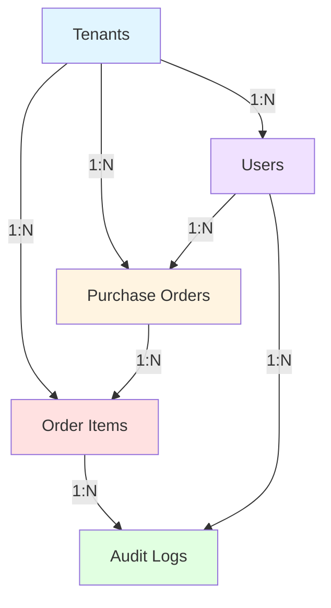

# FlexFlow - Plano de Implementação

## 📋 Resumo Executivo

Este documento descreve o plano completo para implementação do sistema FlexFlow, uma plataforma de gerenciamento de pedidos de compra com suporte a Multi-tenancy usando FastAPI e PostgreSQL.

---

## 🎯 Objetivos Principais

1. ✅ Criar estrutura de pastas `/backend` e `/frontend`
2. ✅ Definir arquitetura do banco de dados com Multi-tenancy
3. ✅ Especificar modelos SQLAlchemy com relacionamentos 1:N
4. ✅ Implementar sistema de auditoria com blockchain simplificado
5. 🔄 Criar arquivos de código Python
6. ⏳ Configurar ambiente de desenvolvimento

---

## 📁 Estrutura de Arquivos Criada

```
FlexFlow/
├── README.md
├── plans/
│   ├── flexflow-database-architecture.md    ✅ Criado
│   ├── models-implementation.md             ✅ Criado
│   └── implementation-plan.md               ✅ Criado
├── backend/                                  ✅ Existe
│   ├── requirements.txt                      ⏳ A criar
│   ├── models.py                             ⏳ A criar
│   ├── database.py                           ⏳ A criar
│   ├── config.py                             ⏳ A criar
│   └── .env.example                          ⏳ A criar
├── frontend/                                 ✅ Existe
└── docs/                                     ✅ Existe
```

---

## 🗄️ Arquitetura do Banco de Dados

### Tabelas Implementadas

| Tabela | Propósito | Relacionamentos |
|--------|-----------|-----------------|
| **tenants** | Empresas/Organizações | 1:N com users, purchase_orders, order_items |
| **users** | Usuários do sistema | N:1 com tenants |
| **purchase_orders** | Pedidos de compra (Pai) | N:1 com tenants, 1:N com order_items |
| **order_items** | Itens de pedido (Filho) | N:1 com purchase_orders, N:1 com tenants |
| **audit_logs** | Logs de auditoria | N:1 com order_items, N:1 com users |

### Diagrama de Relacionamentos



---

## 🔑 Características Principais

### 1. Multi-tenancy
- **Estratégia**: Shared Database, Shared Schema
- **Isolamento**: Coluna `tenant_id` em todas as tabelas principais
- **Segurança**: Validação automática de tenant em todas as queries

### 2. Relacionamento Pai-Filho
- **Pai**: `purchase_orders` (PO)
- **Filho**: `order_items` (Itens)
- **Cardinalidade**: 1:N (Uma PO pode ter múltiplos itens)
- **Integridade**: CASCADE DELETE configurado

### 3. Sistema de Auditoria
- **Algoritmo**: Hash SHA-256 encadeado
- **Imutabilidade**: INSERT only (sem UPDATE/DELETE)
- **Rastreamento**: Todas as mudanças de status em `order_items`
- **Verificação**: Função para validar integridade da cadeia

### 4. Chaves Primárias UUID
- Todas as tabelas usam UUID v4
- Geração automática via `uuid.uuid4()`
- Melhor para sistemas distribuídos

---

## 📦 Dependências (requirements.txt)

```
fastapi==0.109.0              # Framework web
uvicorn==0.27.0               # Servidor ASGI
sqlalchemy==2.0.25            # ORM
psycopg2-binary==2.9.9        # Driver PostgreSQL
python-jose[cryptography]     # JWT tokens
passlib[bcrypt]               # Hash de senhas
pydantic[email]               # Validação de dados
python-multipart              # Upload de arquivos
alembic==1.13.1               # Migrations
python-dotenv==1.0.0          # Variáveis de ambiente
```

---

## 🔧 Modelos SQLAlchemy

### Tenant
```python
class Tenant(Base):
    id: UUID (PK)
    name: String(255)
    cnpj: String(18) UNIQUE
    is_active: Boolean
    created_at: DateTime
    updated_at: DateTime
```

### User
```python
class User(Base):
    id: UUID (PK)
    tenant_id: UUID (FK → tenants.id)
    name: String(255)
    email: String(255)
    hashed_password: String(255)
    role: String(50)
    area_id: UUID (nullable)
    is_active: Boolean
    created_at: DateTime
    updated_at: DateTime
    
    # Constraint: UNIQUE(tenant_id, email)
```

### PurchaseOrder (Pai)
```python
class PurchaseOrder(Base):
    id: UUID (PK)
    tenant_id: UUID (FK → tenants.id)
    po_number: String(100)
    status_macro: String(50)
    created_at: DateTime
    updated_at: DateTime
    created_by: UUID (FK → users.id)
    
    # Constraint: UNIQUE(tenant_id, po_number)
    # Status: DRAFT, SUBMITTED, APPROVED, IN_PROGRESS, COMPLETED, CANCELLED
```

### OrderItem (Filho)
```python
class OrderItem(Base):
    id: UUID (PK)
    po_id: UUID (FK → purchase_orders.id)
    tenant_id: UUID (FK → tenants.id)
    sku: String(100)
    quantity: Integer (CHECK > 0)
    price: Numeric(10,2) (CHECK >= 0)
    status_item: String(50)
    created_at: DateTime
    updated_at: DateTime
    
    # Status: PENDING, ORDERED, RECEIVED, QUALITY_CHECK, APPROVED, REJECTED, CANCELLED
```

### AuditLog
```python
class AuditLog(Base):
    id: UUID (PK)
    item_id: UUID (FK → order_items.id)
    from_status: String(50) (nullable)
    to_status: String(50)
    hash: String(64)
    previous_hash: String(64) (nullable)
    created_at: DateTime
    changed_by: UUID (FK → users.id)
    metadata: JSONB (nullable)
```

---

## 🔐 Regras de Negócio

### Multi-tenancy
1. ✅ Todas as queries filtram por `tenant_id`
2. ✅ Usuários só acessam dados do próprio tenant
3. ✅ Validação de `tenant_id` em todas as escritas

### Relacionamento PO → Items
1. ✅ Uma PO pode ter 0 ou mais itens
2. ✅ Itens não existem sem PO pai
3. ✅ DELETE CASCADE: deletar PO remove todos os itens

### Auditoria
1. ✅ Toda mudança de status gera `audit_log`
2. ✅ Hash calculado antes de inserir
3. ✅ `previous_hash` referencia último log do item
4. ✅ Logs são imutáveis (INSERT only)

### Validações
1. ✅ CNPJ único no sistema
2. ✅ Email único por tenant
3. ✅ PO number único por tenant
4. ✅ Quantity e Price valores positivos

---

## 📝 Próximos Passos

### Fase 1: Implementação Backend (Atual)
- [ ] Criar `backend/requirements.txt`
- [ ] Criar `backend/models.py`
- [ ] Criar `backend/database.py`
- [ ] Criar `backend/config.py`
- [ ] Criar `.env.example`

### Fase 2: Configuração do Banco
- [ ] Configurar Alembic para migrations
- [ ] Criar migration inicial
- [ ] Criar seeds para dados de teste
- [ ] Testar criação das tabelas

### Fase 3: API REST
- [ ] Criar endpoints CRUD para Tenants
- [ ] Criar endpoints CRUD para Users
- [ ] Criar endpoints CRUD para Purchase Orders
- [ ] Criar endpoints CRUD para Order Items
- [ ] Implementar middleware de tenant isolation

### Fase 4: Autenticação e Autorização
- [ ] Implementar JWT authentication
- [ ] Criar sistema de roles e permissões
- [ ] Implementar middleware de autorização
- [ ] Criar endpoints de login/logout

### Fase 5: Auditoria e Logs
- [ ] Implementar trigger automático para audit_logs
- [ ] Criar endpoint para consultar histórico
- [ ] Implementar verificação de integridade
- [ ] Dashboard de auditoria

### Fase 6: Testes
- [ ] Testes unitários dos modelos
- [ ] Testes de integração da API
- [ ] Testes de isolamento de tenant
- [ ] Testes de integridade da auditoria

### Fase 7: Frontend
- [ ] Definir tecnologia (React/Vue/Angular)
- [ ] Criar estrutura de componentes
- [ ] Implementar autenticação
- [ ] Criar interfaces de CRUD

### Fase 8: Deploy
- [ ] Configurar Docker
- [ ] Configurar CI/CD
- [ ] Deploy em ambiente de staging
- [ ] Deploy em produção

---

## 🛠️ Comandos Úteis

### Instalar Dependências
```bash
cd backend
pip install -r requirements.txt
```

### Criar Migration Inicial
```bash
alembic init alembic
alembic revision --autogenerate -m "Initial migration"
alembic upgrade head
```

### Executar Servidor de Desenvolvimento
```bash
uvicorn main:app --reload --host 0.0.0.0 --port 8000
```

### Executar Testes
```bash
pytest tests/ -v
```

---

## 📊 Métricas de Sucesso

- ✅ Arquitetura do banco de dados definida
- ✅ Modelos SQLAlchemy especificados
- ✅ Sistema de Multi-tenancy projetado
- ✅ Sistema de auditoria com blockchain implementado
- ⏳ Código Python criado e testado
- ⏳ API REST funcional
- ⏳ Testes com cobertura > 80%
- ⏳ Documentação completa

---

## 🎓 Decisões Técnicas

### Por que UUID?
- Melhor para sistemas distribuídos
- Evita conflitos em multi-tenancy
- Não expõe informações sequenciais

### Por que Shared Schema?
- Mais simples de gerenciar
- Melhor performance para muitos tenants pequenos
- Facilita backups e migrations

### Por que Hash Encadeado?
- Garante imutabilidade dos logs
- Detecta adulterações
- Simples de implementar e verificar

### Por que SQLAlchemy 2.0?
- Typed mappings modernos
- Melhor performance
- Suporte a async (futuro)

---

## 📞 Contato e Suporte

Para dúvidas sobre a arquitetura ou implementação, consulte:
- [`flexflow-database-architecture.md`](flexflow-database-architecture.md) - Detalhes do banco
- [`models-implementation.md`](models-implementation.md) - Código completo dos modelos

---

**Status**: ✅ Planejamento Completo | 🔄 Aguardando Implementação

**Última Atualização**: 2026-03-16
